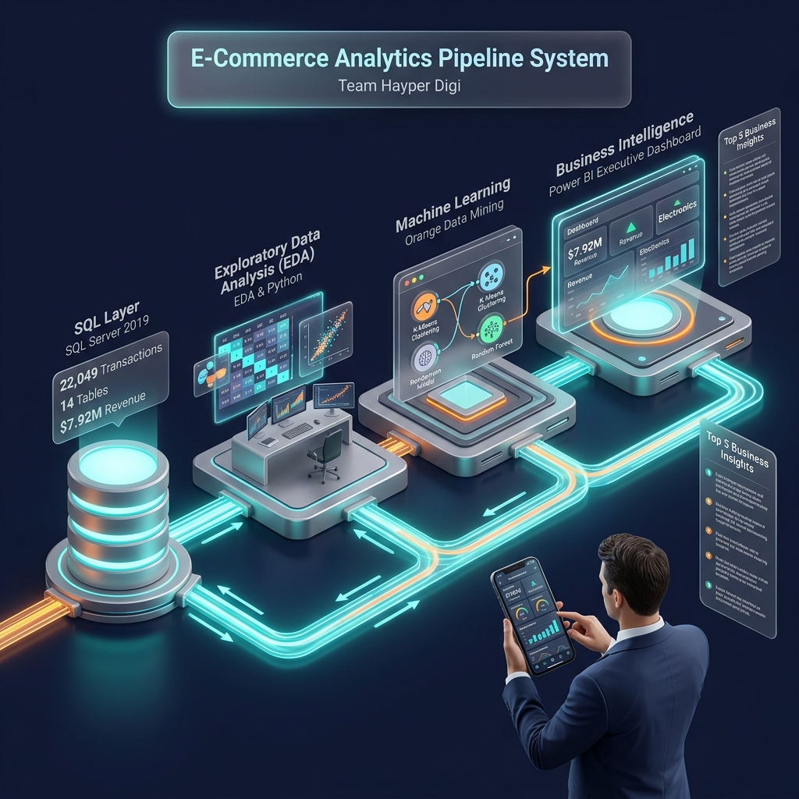
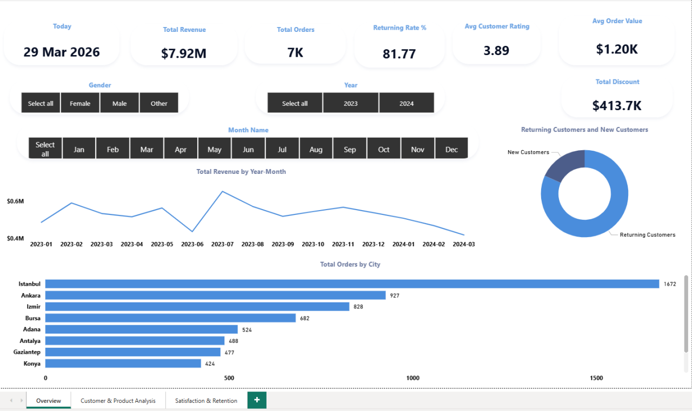
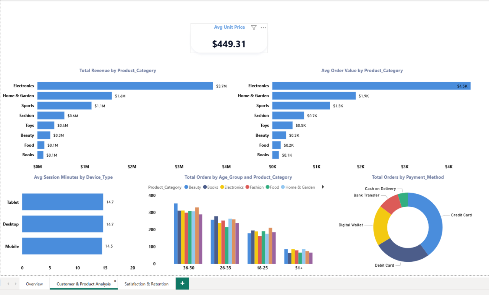
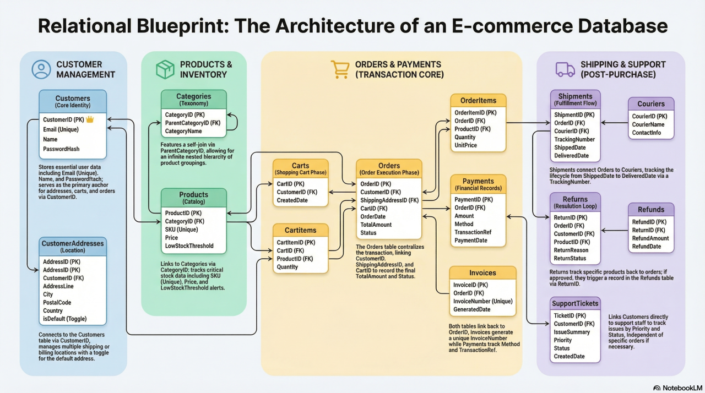
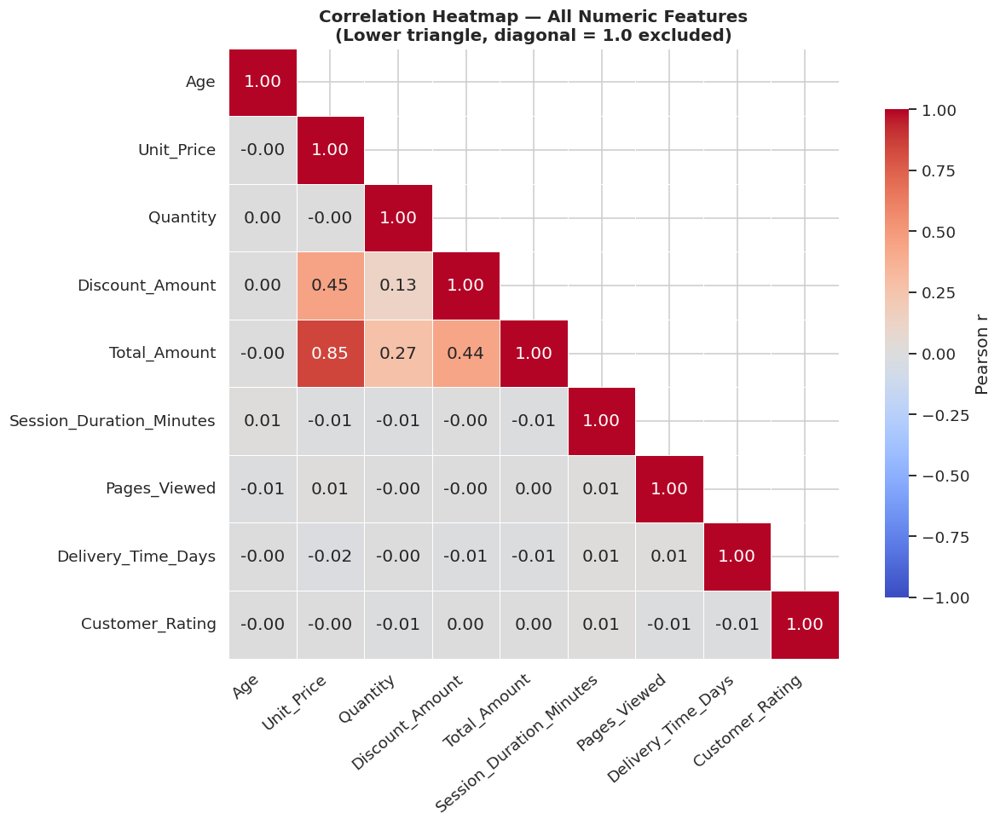
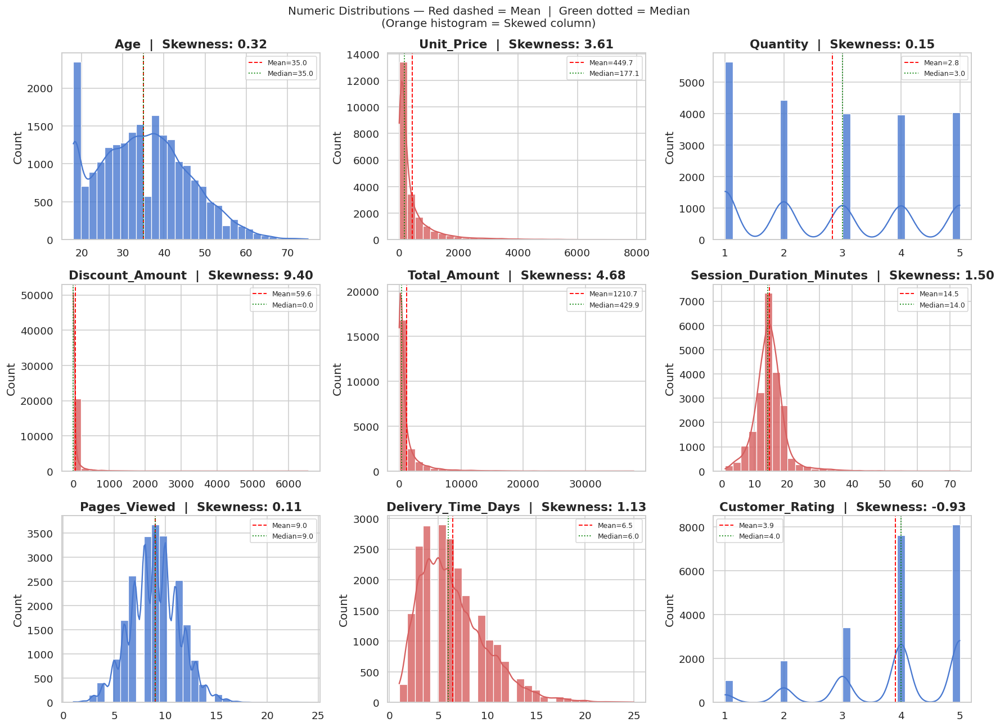
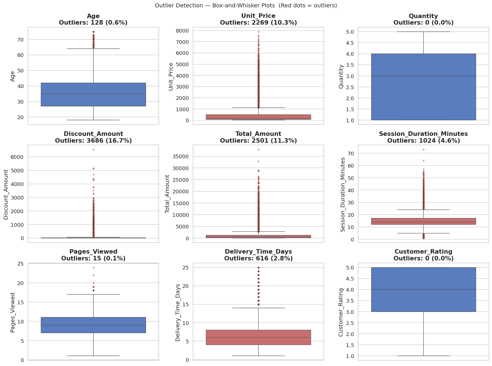

<div align="center">
  
</div>

<br/>

<div align="center">

# 🛒 E-Commerce Store Management & Analytics Ecosystem

[](https://www.python.org/)
[](https://www.microsoft.com/sql-server)
[](https://powerbi.microsoft.com/)
[](https://orangedatamining.com/)
[](https://pandas.pydata.org/)
[](https://scikit-learn.org/)

<br/>

**👥 Team:** `Hyper Digi` &nbsp;|&nbsp; **📅 Academic Year:** `2025 – 2026` &nbsp;|&nbsp; **⏱️ Development Duration:** `45 Days`

**🏛️ Affiliation:** Military Technical College (MTC) & Digital Pioneers Initiative (DEPI)

</div>

---

## 📋 Executive Summary

> **This repository contains the complete, end-to-end implementation of a professional-grade E-Commerce Data Analytics & Machine Learning Ecosystem.** Built over 45 intensive days by the **Hyper Digi** team, the system was designed to architect, populate, and analytically interrogate a multi-table relational database while simultaneously deriving actionable business intelligence from a large-scale transactional dataset.
>
> The project spans the full data science lifecycle — from raw database engineering through exploratory analysis, unsupervised customer segmentation, supervised machine learning, and finally to executive-ready business intelligence dashboards. The dataset encompasses **22,049 transactional records** across **10 major Turkish metropolitan cities**, tracking **$7.92M** in total revenue.

<br/>

<div align="center">

| 📊 Metric | 🔢 Value |
|:---|:---|
| **Total Transactional Records** | 22,049 |
| **Total Revenue Tracked** | $7.92 Million |
| **Database Tables** | 14 Normalized Tables |
| **Foreign Key Constraints** | 22 Referential Integrity Constraints |
| **SQL Analytical Queries** | 10 Business-Intelligence Queries |
| **Cities Covered** | 10 Turkish Metropolitan Cities |
| **Cart-to-Order Conversion Rate** | 85.71% |
| **Best ML Model (AUC)** | Random Forest — AUC = 0.802 |
| **Top Revenue Category** | Electronics ($3.7M) |
| **Orange DM Pipeline Widgets** | 35 Interconnected Widgets |

</div>

---

## 👥 Team Structure & Roles

<div align="center">

### 🏆 Team: Hyper Digi

</div>

<table>
  <thead>
    <tr>
      <th align="center">Role</th>
      <th align="center">Name</th>
      <th align="center">Core Responsibilities</th>
    </tr>
  </thead>
  <tbody>
    <tr>
      <td align="center"><strong>⭐ Team Leader & Lead Data Scientist</strong></td>
      <td align="center"><strong>Mohamed Khaled Mahmoud</strong></td>
      <td>
        <ul>
          <li>🧭 <strong>Project Orchestration</strong> — Full lifecycle oversight across all 4 phases</li>
          <li>🐍 <strong>EDA Architecture</strong> — Designed and executed the complete 20-question Python EDA pipeline (Pandas, Seaborn, Matplotlib)</li>
          <li>📝 <strong>Technical Report Compilation</strong> — Authored all formal academic documentation and Phase reports</li>
          <li>🎤 <strong>Project Presentation Leadership</strong> — Led all technical presentations and academic defenses</li>
          <li>🎯 <strong>Strategic Conclusions</strong> — Drafted all data-driven business recommendations and executive summaries</li>
          <li>🔍 <strong>Statistical Modeling</strong> — Correlation analysis, feature engineering, outlier treatment strategy</li>
        </ul>
      </td>
    </tr>
    <tr>
      <td align="center"><strong>🗄️ Database Engineer</strong></td>
      <td align="center">Team — Hyper Digi</td>
      <td>SQL Server schema design, DDL scripting, ETL pipeline, Business Queries</td>
    </tr>
    <tr>
      <td align="center"><strong>🤖 ML Engineer</strong></td>
      <td align="center">Team — Hyper Digi</td>
      <td>Orange DM pipeline construction, K-Means clustering, Random Forest classification</td>
    </tr>
    <tr>
      <td align="center"><strong>📊 BI Developer</strong></td>
      <td align="center">Team — Hyper Digi</td>
      <td>Power BI dashboard design, KPI tracking, live SQL connection orchestration</td>
    </tr>
  </tbody>
</table>

---

## 🗺️ End-to-End Workflow Overview — The A to Z Pipeline

```
 RAW DATA  ──►  SQL SERVER  ──►  PYTHON EDA  ──►  ORANGE DM  ──►  POWER BI
   CSV            Phase 1          Phase 2          Phase 3         Phase 4
  Files          Database         Analysis         ML Models      Dashboards
```

---

### 🔷 Phase 1 — Data Engineering & Database Architecture (SQL Server)

> **Objective:** Design and implement an enterprise-grade relational database that faithfully models the full lifecycle of an e-commerce platform.

The database was engineered in **Microsoft SQL Server 2019**, adhering to **Third Normal Form (3NF)** normalization principles. The schema was constructed to be horizontally scalable, future-proof, and optimized for both transactional throughput and analytical querying.

**🏗️ Architecture Highlights:**

- **14 Fully Normalized Relational Tables** spanning four functional domains:
  - *Customer Management:* `Customers`, `CustomerAddresses`
  - *Products & Inventory:* `Categories`, `Products`, `Carts`, `CartItems`
  - *Orders & Payments (Transaction Core):* `Orders`, `OrderItems`, `Payments`, `Invoices`
  - *Shipping & Support (Post-Purchase):* `Shipments`, `Couriers`, `Returns`, `Refunds`, `SupportTickets`

- **22 Foreign Key Constraints** enforcing referential integrity across the entire schema — preventing orphaned records and ensuring every transaction can be traced to its originating customer, product, and order context.

- **6 Optimized Database Views** encapsulating complex multi-table join logic:
  - `vw_CustomerMaster` — Denormalized customer profile with lifetime spend & order count
  - `vw_ProductCatalog` — Product listings with real-time `StockStatus` derived via `CASE` logic
  - `vw_OrderDetails` — Five-table master join powering Power BI dashboards
  - `vw_ReturnRefundSummary`, `vw_SupportSLA`, `vw_DailySalesSummary`

- **ETL Pipeline:** `BULK INSERT` operations with `TABLOCK`, `KEEPIDENTITY`, and `FIRSTROW=2` parameters loaded 22,049+ records across all tables in strict foreign-key-dependency order, with zero data loss validated post-ingestion.

- **PERSISTED Computed Column:** `OrderItems.LineTotal = Quantity * UnitPrice` — stored physically on disk for query performance optimization, avoiding runtime computation during analytical aggregations.

**📊 The 10 Strategic SQL Business Queries:**

| # | Query | Business Purpose | Key Technology |
|---|-------|-----------------|----------------|
| Q1 | Active Customer Master View | VIP customer identification | `LEFT JOIN`, `GROUP BY`, `TOP 20` |
| Q2 | Total Sales by Product Category | Revenue segment analysis | `SUM()`, `GROUP BY`, `ORDER BY DESC` |
| Q3 | Daily Sales KPI Summary | Rolling operational monitoring | `CAST()`, `DATEADD()`, `NULLIF()` |
| Q4 | Order Distribution by City | Geographical logistics planning | `COUNT()`, `GROUP BY City` |
| Q5 | Top Selling Products by Quantity | Inventory restocking alerts | `SUM(Quantity)`, Multi-table `JOIN` |
| Q6 | Category Product Rankings | Within-category leaderboard | `DENSE_RANK() OVER PARTITION BY` |
| Q7 | Returns & Refunds Analytics | Return reason root-cause analysis | `CTE`, `COUNT()`, `TOP 5` |
| **Q8** | **Cart-to-Order Conversion** | **Checkout funnel efficiency** | **`CAST()`, `NULLIF()` → 85.71%** |
| Q9 | Delivery Performance Report | Courier SLA monitoring | `AVG(DATEDIFF())`, `CASE WHEN` |
| Q10 | Revenue by Payment Method | Payment gateway negotiation | `CASE WHEN`, `LEFT JOIN` |

---

### 🔷 Phase 2 — Exploratory Data Analysis & Feature Engineering (Python)

> **Objective:** Transform raw transactional data into statistically validated, insight-rich intelligence through systematic Python-powered exploration. This phase represents the core technical contribution of Team Leader **Mohamed Khaled Mahmoud**.

**🐍 Technology Stack:** `Python 3.10+` · `Pandas` · `NumPy` · `Matplotlib` · `Seaborn` · `Jupyter Notebook`

**📦 Dataset Profile:**

| Attribute | Detail |
|-----------|--------|
| **Records** | 22,049 transactional rows |
| **Features** | 20 columns (7 categorical, 11 numeric, 2 text/datetime) |
| **Geographic Coverage** | 10 Turkish Cities (Istanbul, Ankara, Izmir, Bursa, Adana, Antalya, Gaziantep, Konya, Eskişehir, Kayseri) |
| **Temporal Coverage** | January 2023 — March 2024 (15 months) |
| **Missing Data Rate** | 0.018% (4 records in `Pages_Viewed` & `Is_Returning_Customer`) |

**🔬 EDA Pipeline — 20 Analytical Questions Answered:**

**`Q11` | Numerical Distributions (Histograms)**
- `Unit_Price` exhibits severe right-skew (Skewness: 3.61) — Mean: $449.70, Median: $177.10 — indicating log-transformation necessity for linear models.
- `Total_Amount` skewness of 4.68 confirms the long-tail revenue distribution driven by high-value Electronics outliers.
- `Age` distribution is near-uniform (Skewness: 0.32), confirming the platform serves all demographics equally.

**`Q12` | Outlier Detection (Box-and-Whisker Plots)**
- `Discount_Amount`: 3,686 outliers (16.7%) — discounts are the exception, not the rule (median = $0).
- `Unit_Price`: 2,269 outliers (10.3%) — premium VIP transactions reaching up to $7,900.
- `Total_Amount`: 2,501 outliers (11.3%) reaching $37,852 — preserved as legitimate premium purchases, not errors.

**`Q13` | Categorical Summary Analysis**
- `Istanbul` dominates with 5,686 records; `Mobile` is the dominant device type (12,338 records).
- `Credit Card` leads payment methods at 8,813 transactions (≈40% share across all categories).
- Product categories are remarkably balanced (2,678–2,915 transactions each).

**`Q16` | Visual Correlation Check (Scatter Plots)**
- `Unit_Price vs Total_Amount`: Pearson r = **0.848** — the strongest bivariate relationship in the dataset.
- `Unit_Price vs Discount_Amount`: r = 0.452 — higher-priced items attract larger absolute discounts.

**`Q17` | Category × Numeric Effect (Bar Charts)**
- `Electronics` AOV: **$4,748** — 3.9× the dataset mean of $1,210.70.
- `Books` AOV: $153 — the lowest-value category despite respectable transaction volume.

**`Q18` | Category × Category Relationships (Crosstab Heatmap)**
- Credit Card dominates across all product categories (38.8%–41.1% row share).
- Cash on Delivery is consistently the least preferred method (4.3%–5.7%) regardless of category.

**`Q19` | Multivariate Correlation Heatmap**
- `Unit_Price → Total_Amount`: r = 0.85 (primary revenue lever is *premium pricing*, not volume).
- `Quantity → Total_Amount`: r = 0.27 (weak — mass-selling cheap items does not drive revenue).
- `Age → Total_Amount`: r = -0.00 (age is irrelevant as a revenue predictor).

---

### 🔷 Phase 3 — Predictive Modeling & Data Mining (Orange Data Mining)

> **Objective:** Transition from descriptive analytics ("what happened") to predictive analytics ("what will happen") using a comprehensive visual machine learning pipeline.

**🔧 Pipeline Architecture:** 35 interconnected widgets across 5 analytical phases

```
[File] → [Data Table] → [Feature Statistics]
  ↓
[Distributions] → [Box Plots ×4] → [Scatter Plots ×3] → [Correlations]
  ↓
[K-Means Clustering (K=3)] → [Scatter Plots ×4]
  ↓
[Select Columns] → [Impute] → [Data Sampler (70/30)] → [Preprocess] → [Outliers]
  ↓
[Decision Tree] + [SVM] + [Random Forest] → [Test & Score] → [Confusion Matrix]
  ↓
[Predictions] → [Save Data]
```

**🎯 K-Means Customer Segmentation (K=3 Clusters):**

| Cluster | Segment Name | Characteristics | Business Action |
|---------|-------------|-----------------|----------------|
| **Cluster 0** | 💤 Casual Buyers | Low spend, short sessions (<10 min) | Re-engagement campaigns |
| **Cluster 1** | 🔄 Regular Customers | Moderate spend, avg. sessions (10–20 min) | Upsell promotions |
| **Cluster 2** | 👑 VIP Loyalists | High spend, long sessions (>20 min) | Premium loyalty rewards |

**🤖 Classification Model Comparison (Target: `Is_Returning_Customer`):**

| Model | AUC | Accuracy (CA) | F1 Score | Precision | Recall |
|-------|-----|---------------|----------|-----------|--------|
| Decision Tree | 0.520 | 0.729 | 0.729 | 0.731 | 0.728 |
| SVM | 0.565 | 0.789 | 0.736 | 0.769 | 0.789 |
| **🏆 Random Forest** | **0.627** | **0.802** | **0.743** | **0.724** | **0.802** |

**🔑 Top Predictive Features (via RReliefF Rank Widget):**
1. `Session_Duration_Minutes` — Highest predictive power: longer browsers become loyal buyers
2. `Gender=Other` — Significant discriminating categorical feature
3. `Quantity` — Order quantity distinguishes returning from one-time customers
4. `City=Kayseri` — Geographic feature with discriminating value
5. `Date` — Temporal purchasing patterns indicate loyalty behavior

---

### 🔷 Phase 4 — Business Intelligence & Orchestration (Power BI)

> **Objective:** Translate analytical findings into interactive, executive-ready dashboards enabling real-time data-driven decision making.

**Three live-connection dashboards were built, each targeting a distinct stakeholder audience:**

**📊 Dashboard 1 — Executive Operations Overview**
- **Total Revenue:** $7.92M | **Total Orders:** 7K | **Avg. Order Value:** $1.20K
- **Returning Rate:** 81.77% | **Avg. Customer Rating:** 3.89/5 | **Total Discounts:** $413.7K
- **Geographic Insight:** Istanbul leads with 1,672 orders; Ankara (927), Izmir (828) follow
- **Temporal Insight:** Revenue trend from Jan 2023 – Mar 2024 with visible Q4 peaks

**📊 Dashboard 2 — Customer & Product Analytics**
- **Avg. Unit Price:** $449.31 | Electronics dominates at $3.7M total revenue
- **Avg. Order Value by Category:** Electronics ($4.5K), Home & Garden ($1.9K), Sports ($1.3K)
- **Device Distribution:** Session times nearly equal across Tablet (14.7 min), Desktop (14.7 min), Mobile (14.5 min)
- **Age-Group Ordering:** 36–50 age group places the highest order volumes across all categories

**📊 Dashboard 3 — Satisfaction & Retention**
- **Returning Rate by City:** Bursa & Konya lead at 84%; Ankara & Kayseri at 79%
- **Customer Rating vs. Orders:** Higher ratings correlate with 4- and 5-star order volumes exceeding 2K
- **Delivery Performance:** Average delivery time ranges 6.1–6.7 days across cities
- **Key KPI Validated:** Cart-to-Order Conversion = **85.71%**

---

## 💡 Key Business Insights

> The following findings were consistently validated across all four analytical phases — SQL, Python EDA, Orange ML, and Power BI dashboards:

- 🏆 **Electronics is the undisputed revenue champion** — generating $3.7M (≈47% of total revenue) with an average order value of $4,748, nearly 4× the dataset mean. All marketing investment in premium electronics yields the highest ROI.

- 💰 **Premium pricing beats volume selling** — The Pearson correlation coefficient of r=0.85 between `Unit_Price` and `Total_Amount` confirms that revenue maximization is driven by high-ticket products, not transaction frequency.

- 🌆 **Istanbul dominates geographically** — accounting for 1,672 orders (the single largest city share), followed by Ankara (927) and Izmir (828). Infrastructure and logistics should be prioritized for these three cities.

- 🛒 **85.71% Cart-to-Order Conversion** — Of 3,500 carts created, 3,000 converted to orders, indicating a highly optimized checkout experience that should be maintained and benchmarked.

- 📱 **Mobile is the dominant device** — 12,338 out of 22,049 transactions originated on mobile (56%), validating the need for a mobile-first UX strategy.

- 💳 **Credit Card is the universal payment method** — commanding 38.8%–41.1% share across all product categories consistently, making it the priority gateway for merchant fee negotiations.

- ⏱️ **Session duration predicts loyalty** — The #1 ML feature predictor of returning customers is `Session_Duration_Minutes`. Investing in site engagement and browsing experience directly converts one-time buyers into loyal repeat customers.

- 📦 **Sports leads transaction volume; Electronics leads revenue** — This "volume vs. value" dichotomy is the most actionable strategic insight: Sports/Daily Essentials generate footfall; Electronics generates profit.

- 📅 **Q4 seasonal peaks are confirmed** — Temporal analysis across the 15-month dataset reveals consistent revenue spikes in October–December, enabling proactive inventory and staffing alignment.

- 🔄 **81.77% returning customer rate** — An exceptionally high retention metric, indicating strong platform loyalty. The Random Forest model (AUC=0.802) can proactively identify which new customers are likely to join this group.

---

## 🛠️ Technologies Used

<div align="center">

[](https://www.python.org/)
[](https://pandas.pydata.org/)
[](https://numpy.org/)
[](https://seaborn.pydata.org/)
[](https://matplotlib.org/)
[](https://scikit-learn.org/)
[](https://www.microsoft.com/sql-server)
[](https://powerbi.microsoft.com/)
[](https://orangedatamining.com/)
[](https://jupyter.org/)

</div>

| Tool | Version | Phase | Purpose |
|------|---------|-------|---------|
| **Microsoft SQL Server** | 2019 | Phase 1 | RDBMS — 14-table schema, ETL, Business Queries |
| **Python** | 3.10+ | Phase 2 | EDA, Feature Engineering, Statistical Analysis |
| **Pandas** | 2.x | Phase 2 | Data manipulation, cleaning, groupby aggregations |
| **NumPy** | 1.26+ | Phase 2 | Numerical computation, array operations |
| **Matplotlib** | 3.8+ | Phase 2 | Publication-quality static visualizations |
| **Seaborn** | 0.13+ | Phase 2 | Statistical plotting (heatmaps, boxplots, pairplots) |
| **Scikit-Learn** | 1.4+ | Phase 2/3 | Preprocessing, encoding, model preparation |
| **Orange Data Mining** | 3.36 | Phase 3 | Visual ML pipeline (35 widgets), K-Means, Random Forest |
| **Microsoft Power BI** | Latest | Phase 4 | Interactive executive dashboards, live SQL connection |
| **Jupyter Notebook** | 7.x | Phase 2 | Interactive EDA environment |

---

## 📁 Repository Structure

```
📦 E-Commerce-Analytics-Ecosystem/
├── 📄 README.md                          # This file
├── 🖼️ banner.png                         # Project pipeline banner
│
├── 📂 Phase1_SQL/
│   ├── E_COMMERCE_Company_Project.sql    # Complete DDL + DML + Views + Queries
│   └── Database_Table_For_Sql.png        # ERD Architecture Diagram
│
├── 📂 Phase2_EDA/
│   ├── main.py                           # Production-grade EDA Python script
│   ├── E-Commerce_Customer_Behavior_EDA_.ipynb  # Jupyter Notebook
│   ├── EDA-Outliers_Boxplots.png
│   ├── Numeric_DistributionsHistograms.png
│   ├── EDA-_Categorical_Summary_Top_categories.png
│   ├── EDA-_Visual_CheckScatter_plots_for_key_pairs.png
│   ├── EDA-_Multivariate_Heatmap.png
│   ├── EDA-_Category_Numeric_Effect.png
│   └── EDA-Category_Category_Relationship.png
│
├── 📂 Phase3_Orange/
│   └── E-Commerce_Loyalty_Analytics__Orange.pptx
│
├── 📂 Phase4_PowerBI/
│   ├── DashbordPowerBI1.png              # Executive Overview Dashboard
│   └── DashbordPowerBI2.png             # Customer & Product Analytics Dashboard
│
└── 📂 Reports/
    ├── E_Commerce_Full_Project_Workflow.pdf
    ├── E-Commerce_Project_Report_.pdf
    └── Orange_Report.pdf
```

---

## 🚀 Quick Start

```bash
# 1. Clone the repository
git clone https://github.com/hyperdigi/ecommerce-analytics-ecosystem.git
cd ecommerce-analytics-ecosystem

# 2. Install Python dependencies
pip install pandas numpy matplotlib seaborn scikit-learn jupyter scipy

# 3. Run the EDA pipeline
python main.py

# 4. Or launch the interactive Jupyter Notebook
jupyter notebook "E-Commerce_Customer_Behavior_EDA_.ipynb"

# 5. For SQL: Execute in SQL Server Management Studio (SSMS)
# Open: Phase1_SQL/E_COMMERCE_Company_Project.sql
# Execute in order: DDL → Constraints → Views → DML (BULK INSERT) → Queries
```

---

## 📊 Visual Gallery

<div align="center">

| Power BI — Executive Overview | Power BI — Product Analytics |
|:---:|:---:|
|  |  |

| Database ERD Architecture | EDA — Correlation Heatmap |
|:---:|:---:|
|  |  |

| EDA — Numeric Distributions | EDA — Outlier Detection |
|:---:|:---:|
|  |  |

</div>

---

## 📜 License & Academic Context

This project was prepared in fulfillment of the **Data Mining Course Requirements** at the **Military Technical College (MTC)** under the **Digital Pioneers Initiative (DEPI)**, Academic Year 2025–2026.

> *All methodologies applied are consistent with industry-standard data engineering and analytics practices. The system architecture is designed to demonstrate readiness for professional deployment in real-world data-intensive organizational contexts.*

---

<div align="center">

**Built with ❤️ by Team Hyper Digi · Academic Year 2025–2026**

*"From Raw Data to Strategic Intelligence — The Complete Pipeline"*

</div>
